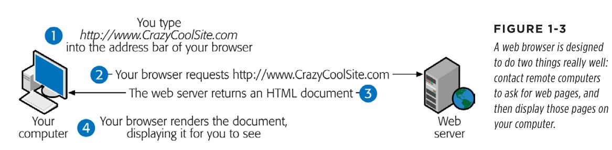
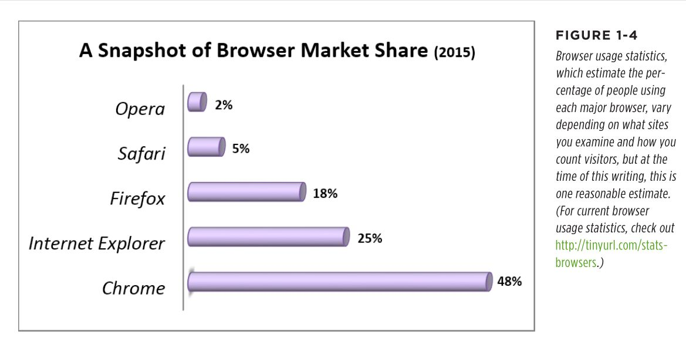
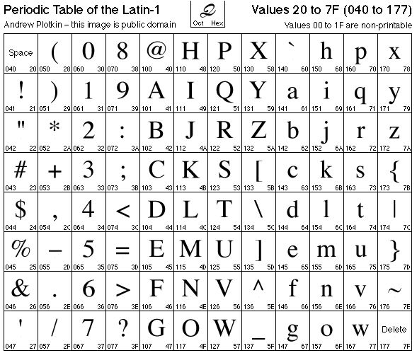

<link rel="stylesheet" href="./conf/styles.css">
# HTML Основи

## Броузърът и интернет

Когато отваряте даден сайт в повечето случаи броузърът зарежда index.html страницата, намираща се на съответния домейн. В този файл обикновенно се оказват какви още картинки, css и js файлове трябва броузъра да свали (и той ги сваля паралелно), за да може да покаже страницата на сайта. Когато файловете се свалени броузърът започва да рисува уеб страницата. С други думи той преобразува текстът на html, css и js файловете и картинките, които е получил в една богата и интерактивна страница.



Уеб страницата може да се зареди както от отдалечен сървър както е показано на горното изображение така и от локалния компютър, което е удобно при разработката на нови сайтове.

Ето каква е популярността на различните броузъри:


Когато създавате уеб страница трябва да знаете каква е вашата аудитория (десктоп, мобилни телефони, кои държави и т.н.). Това в голяма степен определя какво можете и какво не можете да ползвате като технологии (не всички браузъри поддържат всичко) и по какъв начин да направите дизайна на сайта така че да изглежда добре за всички ваши потребители.

Например вие правите онлайн игра за Кения ползвайки последните технологии и всичко изглежда прекрасно, но когато я пускате и започвате да я рекламирате се оказва, че вашите потребители нямат компютри а само евтини телефони с Opera Mini броузър, на който вашана онлайн игра изобщо не работи. Заради това, че не сте проучили потенциалните си потребители вие трябва да пренаписвате играта, което води до големи загуби във време и средства.

Изводи:
- уеб страниците се състоят от html, css, js и изображения
- единствената съставна част без която уеб страницата не може да съществува е html
- трябва да знаете кои са основните броузъри и какви са техните особенности
- трябва да съобразявате технологиите, които ползвате за създаването на сайта с типът на сайта (блог, магазин и т.н.) и неговата аудитория

## Създаване на уеб страница

За уеб програмирането е нужен текстов редактор, който разпознава типовете файлове, с които работите и осигурява подсветка на ключовите думи в тях. Най-популярният редактор в момента е [Visual Studio Code](https://code.visualstudio.com/)

Трябва да познавате добре редактора си:
- да инсталирате нужните приставки, които улесняват работата ви (например Code Runner)
- да научите основните клавишни комбинации - това може да ви спести часове загубено време
- когато почнем да пишем js да се научите как да го дебъгвате през редактора

Ето една примерна html страница:
```html
<!doctype html>
<html>
  <head>
    <title>Моята страница</title>
    <meta charset="utf-8">
  </head>
  <body>
    <h1>Моята страница</h1>
    <p>Добре дошли на моята страница</p>

  </body>
</html>
```
HTML е декларативен език - това означава, че той описва какво трябва да се направи, а не как трябва да се направи (обратно на императивните езици като js). Например има елемент title, но не се обяснява начина, по който заглавието трябва да се появи в хедъра на броузъра. Друг декларативен език е SQL.

Указването на версията на html документа (```<!doctype html>```) е много важна. Причината е че броузърите се стремят да поддържат съвместимост със всички предишни версии (преди HTML5). Някои броузъри (като Internet Explorer) при неспомената версия на документа могат да преминат в режим на съвместимост (quirks mode), считайки че страницата е писана на много стара версия на HTML и поради това показвайки я по неправилен начин.

Мета таговете (```<meta ...>```) винаги се намират в head елемента и съдържат допълнителна информация за страницата, която се използва от броузъра или търсачките, но не се показва на нея. Най-важният мета таг е този, показващ кодирането на символите (```<meta charset="utf-8">```). Когато пишем на хартия написаното еднозначно съотвества на това, което искаме да предадем на четящия написаното от нас. При писането на компютър това не е така, защото се запазва не изображението на буквата, а нейния номер и във всяка различна кодировка номерата на буквите са различни.

{.img}