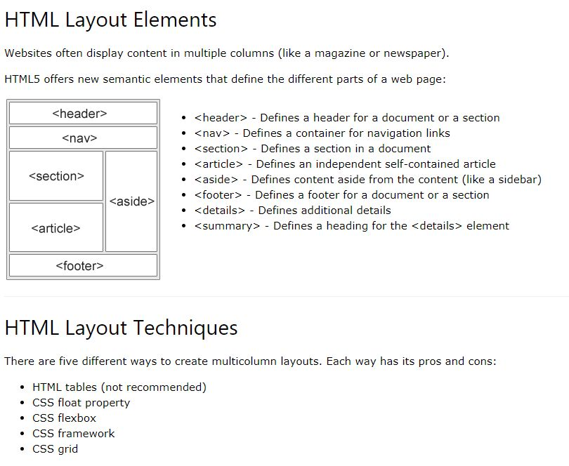

# Основни HTML елементи

## HTML layout



Semantic elements (header, footer, nav, section, article) -  това са елементи, чиято роля е не само да оформят структурата на документа, но и да дават информация на броузъра и търсачките за смисъла на съдържанието в дадения таг. Така търсачките могат да връщат по-точни резултати. Например ако ключовата дума, която са написали в търсачката в дадения сайт се намира в aside елемента (в него се дава странично съдържание или реклами), това означава че тя не е сред основната му информация и съответно този сайт не трябва да се показва на първите места в резултатите от търсенето.

### Header, Footer, Main и Nav
```html
  <body>
    <header>
        <h1>Примерен сайт - Начало</h1>
        <nav>
            <ul>
                <li>Начало</li>
                <li>Новини</li>
                <li>Продукти</li>
                <li>Контакти</li>
            </ul>
        </nav>
    </header>

    <main>
        Основно съдържание
    </main>

    <footer>
        Всички права са запазени 2017 - 2018
        <nav>
            <ul>
                <li>Връзки</li>
                <li>Контакти</li>
            </ul>
        </nav>
    </footer>
  </body>
```
Nav елемента отговаря за менютата в сайта - те може да са разположени на много места, а не само в header и footer. Обикновенно в header елемента се разполага главното меню.

Ето как би изглеждал същия пример, ако не ползваше семантични елементи:
```html
  <body>
    <h1>Примерен сайт - Начало</h1>
    <div>
        <a>Начало</a>
        <a>Новини</a>
        <a>Продукти</a>
        <a>Контакти</a>
    </div>

    <div>
        Основно съдържание
    </div>

    <div>
        Всички права са запазени 2017 - 2018
        <div>
            <a>Връзки</a>
            <a>Контакти</a>
        </div>
    </div>
  </body>
```
Въпреки че броузъра може да показва съдържанието на този документ по сходен начин с предишния пример, но смисълът на това за какво искаме да ползваме всеки от елементите се губи. Това е в още по-голяма сила за реални html документи, които може да са много по-големи по размер и по сложност.

[HTML lessons in russian](https://metanit.com/web/html5/)

[HTML lessons in english](https://www.w3schools.com/html/default.asp)

[HTML Layout](https://www.w3schools.com/html/html_layout.asp)

[HTML Layout Details](http://www-db.deis.unibo.it/courses/TW/DOCS/w3schools/html/html_layout.asp.html)