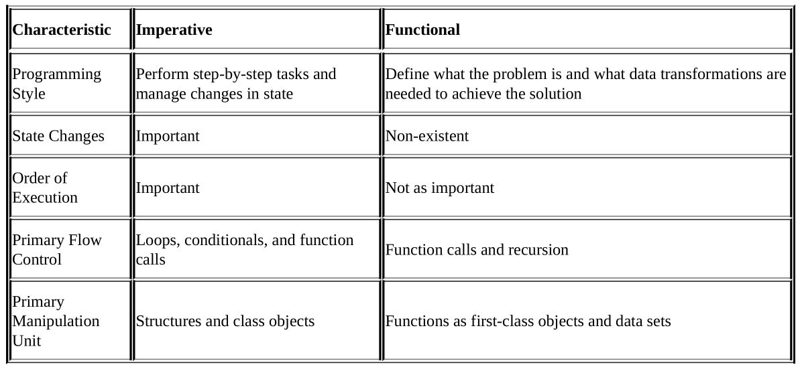

# Functional Programming

## A Function in Mathematics
```
f (X) = Y
```
The statement can be read as “A function f, which takes X as its argument, and returns the output Y.” X and Y can be any number, for instance. That’s a very simple definition. There are key takeaways in the definition, though:
- A function must always take an argument.
- A function must always return a value.
- A function should act only on its receiving arguments
(i.e., X), not the outside world.
- For a given X, there will be only one Y.

### Non functional way
```js
var percentValue = 5;
var calculateTax = (value) => { 
    return value/100 * (100 + percentValue) 
}
```
Here percentValue is hidden argument which makes the function unpredictable (everyone can change percentValue which changes the function output)

### Functional way
```js
var percentValue = 5;
var calculateTax = (value) => { 
    return value/100 * (100 + percentValue) 
}
```
Here we don't have hidden arguments. This makes it easy for testing.

## Imperative, Declarative, Abstraction
Functional programming is also about being declarative and writing abstracted code.
```js
var array = [1,2,3]
for(i=0;i<array.length;i++)
console.log(array[i]) //prints 1, 2, 3
```
this is the imperative approach - it explains **how** to do it

```js
var array = [1,2,3]
array.forEach((element) => console.log(element))
//prints 1, 2, 3
```
the declarative approach explains **what** to do but does not care how is it done (forEach function is a black box, abstract function for us)

Functional programming is about creating functions in an abstracted way that can be reused by other parts of the code. They are called pure functions because they don't cause side effects.

### Functional and non functional languages
Functional is a language on which you can write functional code.

Purely functional languages are: Haskell, Lisp, Erlang.

Non functional languages are: C, Java.

There are a lot of languages that can be both inperative and functional: JavaScript, Python, Kotlin, Ruby, Julia.

Here is an example of how functional and non functional languages behave:


## Advantages of using functional programming

### Cleaner code
Functional programs are cleaner, simpler, and smaller. This simplifies debugging, testing, and maintenance.

Imperative code for converting a two-dimensional array into a
one-dimensional:
```js
function merge2dArrayIntoOne(arrays) {
    var count = arrays.length;
    var merged = new Array(count);
    var c = 0;
    for (var i = 0; i < count; ++i) {
        for (var j = 0, jlen = arrays[i].length; j < jlen; ++j) {
            merged[c++] = arrays[i][j];
        }
    }
    return merged
}
```

Functional code:
```js
function merge2dArrayIntoOne(arrays) {
    return arrays.reduce( function(p,n) {
        return p.concat(n);
    });
};
```

### Reduced coupling
Coupling is the amount of dependency between modules in a program. In functional programming the functions are completely independent and thre si no tight coupling. The tight coupling is espetially problematic in testing because we want to mock some of the modules but we cannot do it because of the tight coupling between them.

### Paralell code
When the functions and modules are not tightly coupled their order of execution is irrelevant. This means that they can be executed in paralell on different processor cores and thus getting the results quicker.

### Cachable
Because pure functions always retuen the same result for the same arguments, then this result can be cached and used again on the next function call if the same arguments are provided.

### Pipelines and Composability
The pipelines is a Unix term which means providing the result of one function to another:
```bash
cat jsBook | grep –i "composing" | wc
```
here we are reading the file jsBook, searching for the word "composing" and counting on how many lines is it present. You can compose any complex bahaviour by pipelining multiple simple functions.

## Disadvantages of using functional programming
There is no one solution to all the problems. Using pure functional programming everywhere (no variables, only functions) can make the code hard to read and write. The best way is using both imperative and functional programming - having the best of both worlds. Where the functional programming excels is when working with arrays and streams of data.

Examples with Lodash - chaining, curiing, composition versus chains (rambda).


## Learn more
- Beginning Functional JavaScript, second edition
- Functional programming in JavaScript
- Lodash
- Rambda